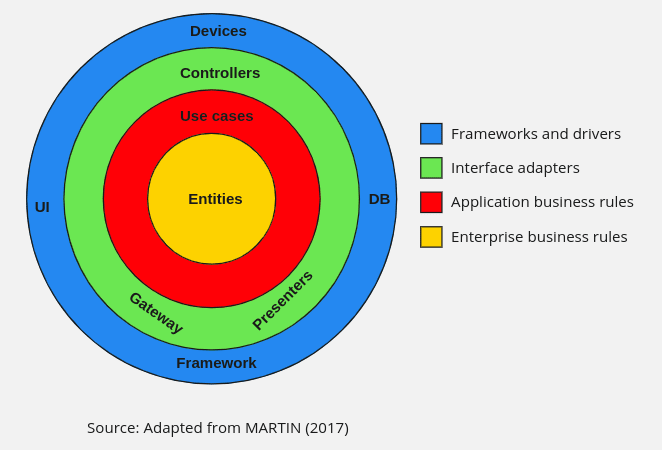

# Fantastic Book Manager
Implementation of the [user story](#user-story) following the requirements:
- .NET C#
- Web API
- Clean Architecture
- Test-Driven Development (TDD) methodologies
- Without using the entity framework
- Create a user, login as the user, and
ensure that the user information is stored in the database
- Data layer & Business logic layer

# Summary
- [User Story](#user-story)
- [Technologies](#technologies)
- [Taken decisions](#taken-decisions)
- [Architecture overview](#architecture-overview)

# User Story
"As a user, I want to be able to manage a collection of books, including adding new books, updating book details, removing books, and viewing a list of all my books. Additionally, I want to have the ability to create an account, log in, and ensure that my book collection is private to me."

### Book Management
Users can perform **CRUD** operations (**C**reate, **R**ead, **U**pdate, **D**elete) on a collection of books. 

### User Authentication
Users can create an account, which includes user registration with email and password.

Users can log in to access their book collection.

User authentication ensures that only authorized users can access and modify their book collection.

### Privacy and Authorization
The user story implies that each user's book collection is private to them, meaning users can only see and modify their own books.

Authorization checks should be in place to ensure that users can only manipulate their own data.

### List of Books
Users should be able to view a list of all their books, with book **title**, **author**, and **genre**.

# Technologies
* [ASP.NET Core 7](https://docs.microsoft.com/en-us/aspnet/core/introduction-to-aspnet-core)
* [FluentValidation](https://fluentvalidation.net/) & [GuardClauses](https://github.com/ardalis/GuardClauses)
* [MediatR](https://github.com/jbogard/MediatR)
* [Docker](https://github.com/docker)
* [ASP.NET Core Identity](https://github.com/dotnet/AspNetCore/tree/main/src/Identity) through [NetDevPack.Identity](https://github.com/NetDevPack/Security.Identity)
* [Dapper](https://github.com/DapperLib/Dapper) & [DbUp](https://github.com/DbUp/DbUp)
* [xUnit](https://github.com/xunit/xunit), [NetArchTest.Rules](https://github.com/BenMorris/NetArchTest), [Moq](https://github.com/moq) & [FluentAssertions](https://github.com/fluentassertions/fluentassertions)

# Taken decisions
* [Entity Framework](#entity-framework)
* [User management / Security](#user-management--security)
* [Using NetDevPack.Identity](#using-netdevpackidentity)
* [Separation of Book and Identity API](#separation-of-book-and-identity-api)
* [Command–query separation (CQS)](#command–query-separation-cqs)
* [Validations](#validations)
* [Error handling](#error-handling)

## Entity Framework
One of the [requirements](#fantastic-book-manager) was to not use the Entity Framework, so [Dapper](https://github.com/DapperLib/Dapper) was used, which has performance as one of its main features and allows us to write queries in raw SQL, but some tool would still be needed to manage changes to the database, so [DbUp](https://github.com/DbUp/DbUp) was chosen, allowing us to write changes to the database in SQL Scripts and [DbUp](https://github.com/DbUp/DbUp) tracks which SQL scripts have already been executed and executes the change scripts necessary to update our database.

## User management / Security
As requested, some form of user authentication was necessary, for this we could follow three different ways:
1. Use an external authentication tool such as [Firebase Authentication](https://code-maze.com/dotnet-firebase-authentication/)
2. Writing this entire user creation and authentication part manually
3. Use a well-known tool that has login functionality

**Alternative (1)** is a good one, but there is a requirement regarding user information being saved in database, so it could be seen as a requirement violation.

**Alternative (2)** would be like trying to reinvent the wheel and we would certainly run into problems such as:
- Time Constraints: Creating our own authentication system from scratch is a time-consuming process
- Expertise: Familiarity with authentication and security best practices is important
- Scalability and maintenance: Long-term maintenance and scalability of our application
- Security: Creating our own system would require a deep understanding of security principles to ensure our system is as secure as possible.

**Alternative (3)** which was chosen because we understood that it would be the best for this scenario, using a tool already known and widely used by the community and which already provides us with resources such as login functionality, user management, passwords, profile data, claims, tokens, email confirmation, and more.

## Using NetDevPack.Identity
To implement the Identity API I chose to use the [NetDevPack.Identity](https://github.com/NetDevPack/Security.Identity) which is a library that already adds several basic implementations of [ASP.NET Identity](https://github.com/dotnet/AspNetCore/tree/main/src/Identity) such as JWT, Claims, Validation and other facilities, this helped **_save time_** and make the Identity API **_extremely simple_**.

## Separation of Book and Identity API
The Book API and the Identity API were separated because thinking about the design of a distributed system or even an application that goes to production, it makes sense to have an application responsible for managing the entire login and access part, imagining the possibility of this growing and have to take care of claims, roles, user management, etc.

## Command–query separation (CQS)
The [controller-service-repository](https://tom-collings.medium.com/controller-service-repository-16e29a4684e5) pattern is widely used and well known, in Clean Architecture we could use this pattern without any problems and the service would be responsible for the Business Logic Layer, however we chose to work with commands, this way we have the Use Cases much more obvious: **CreateBookCommand**, **DeleteBookCommand**.

Adopting the [CQS (command-query separation)](https://en.wikipedia.org/wiki/Command%E2%80%93query_separation) principle also makes it much easier to start working with [events](https://en.wikipedia.org/wiki/Event-driven_architecture), which can be extremely useful in scale scenarios and distributed systems.

By separating the commands from the queries we have very well defined rules where it is clear that the commands will make changes to our database and that the queries will only read information without causing any changes, this allows a much more smoodie adoption of the [CQRS](https://en.wikipedia.org/wiki/Command_Query_Responsibility_Segregation), allowing queries to search for information from another database, which can be extremely useful in a scale scenario.

## Validations
The commands are clear intentions to change our system that receive information directly from our users, bringing the possibility of containing invalid information, for this reason each command has a validation class that follows the **CommandNameValidator** pattern (_CreateBookCommandValidator_), the validation classes are responsible for validate inputed data which are simpler validations and we are using [FluentValidation](https://fluentvalidation.net/) for this.

[Domain-driven design (DDD)](https://en.wikipedia.org/wiki/Domain-driven_design) brings some interesting patterns, one of them is that our business entities must always be valid, this basically means that any change that occurs making our business model invalid must be blocked, **so even not using DDD** we are following this pattern to ensure that there is no change that makes our business model invalid, to do that we adopted [GuardClauses](https://github.com/ardalis/GuardClauses) which checks for invalid inputs up front and immediately failing if any are found.

## Error handling
Unwanted behavior can occur in our application at any time, such as the user trying to enter incorrect data or trying to perform an invalid operation. This means that our application has to validate these behaviors as described in the [validations topic](#validations), but there is an important point: **If this validation is not successful, how can I return this information to the user?** We adopted `IErrorHandler`, which is a service responsible for receiving all operation errors. It is a common interface for our [application layer](#application-layer) and also for the [presentation layer](#presentation-layer), allowing us to send a command and then verify the success of this operation through it.

## Unit tests
As described in the architecture overview part, we have 4 layers and we are performing unit tests for all of them.

### Domain
Business entities are responsible for changing their own information, these changes are being tested using unit tests.

### Application
Using unit tests to test command validations, ensuring that they are validating the command correctly, in addition to properly testing the command handler, ensuring that everything is working as it should in addition to serving as documentation for the code.

### Infrastructure
The infrastructure layer is basically responsible for accessing the data, we also have unit tests for each method that accesses the database, this ensures that the SQL database queries are working as they should, so the SQL database query is really hitting the database, however we are using the concept of transaction, this means that all data written during the tests is removed at the end.

### Presentation
The presentation layer, which in our case has our REST API, is very simple, but the controller methods are responsible for calling correct commands and verifying the success of the operation, to guarantee that we are also using unit tests.

### Architecture
We adopted unit tests in all layers of our application, in addition, written using [NetArchTest.Rules](https://github.com/BenMorris/NetArchTest) to enforce architectural rules in unit tests.

# Architecture overview
The Book API was developed using clean architecture principles.

### Domain Layer
This layer is represented in the image as **Entities**, in the system we call it **Book.Domain**, it will contain our business entities and other items that are the core of the system such as enums, exceptions, types and other items specific to the domain layer.

### Application Layer
This layer is represented in the image as **Use cases**, in the system we call it **Book.Application**, it will contain the behaviors of our system, there we can find our commands that are ways to well describe these behaviors. It is dependent on the domain layer, but has no dependencies on any other layer or project. This layer defines interfaces that are implemented by outside layers. For example, if the application needs to access the database, a new interface would be added to application and an implementation would be created within infrastructure.

### Infrastructure Layer
In the system we call it **Book.Infrastructure**, it contains responsible for accessing external resources such as file systems, data stores, and so on. This layer contains details, concrete implementations for repositories. The decoupling between the application layer and the infrastructure layer is what allows solution structures to change and/or add specific implementations as the project requirements change.

### Presentation Layer
In the system we call it **Book.API**, this layer essentially contains the I/O components of the system could be a mobile application, a web application, in our case it is a REST API. This layer depends on both the Application and Infrastructure layers, however, the dependency on Infrastructure is only to support dependency injection. Therefore only Program.cs should reference Infrastructure.